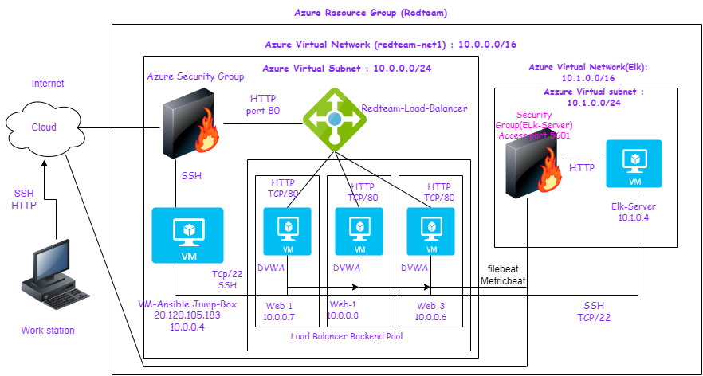

<<<<<<< HEAD
## Automated ELK Stack Deployment

The files in this repository were used to configure the network depicted below.

These files have been tested and used to generate a live ELK deployment on Azure. They can be used to either recreate the entire deployment pictured above. Alternatively, select portions of the Ansible file may be used to install only certain pieces of it, such as Filebeat.

  - _filebeat-playbook.yml._

This document contains the following details:
- Description of the Topology
- Access Policies
- ELK Configuration
  - Beats in Use
  - Machines Being Monitored
- How to Use the Ansible Build

### Description of the Topology

The main purpose of this network is to expose a load-balanced and monitored instance of DVWA, the D*mn Vulnerable Web Application.

Load balancing ensures that the application will be highly responsive, in addition to restricting traffic to the network.
- The advantage of a load balancer is the distribution of traffic across multiple servers. This effectively keeps the system from slowing as well as protects from a DDOS attack.

Integrating an ELK server allows users to easily monitor the vulnerable VMs for changes to the any files and system settings.
- filebeat monitors the specified logs and forwards them to logstash or elastic search.
- metricbeat monitors the metrics and statistics and ships it out to a specified output location.

The configuration details of each machine may be found below.
_Note: Use the [Markdown Table Generator](http://www.tablesgenerator.com/markdown_tables) to add/remove values from the table_.

| Name     | Function | IP Address | Operating System |
|----------|----------|------------|------------------|
| Jump Box | Gateway  | 10.0.0.4   | Linux            |
| web-1    |   VM     | 10.0.0.7   | Linux            |
| web-2    |   VM     | 10.0.0.8   | Linux            |
| web-3    |  VM      | 10.0.0.6   | Linux            |
| Elk-server | Vm     | 10.1.0.4   | Linux            |
|

### Access Policies

The machines on the internal network are not exposed to the public Internet. 

Only the Elk-Server machine can accept connections from the Internet. Access to this machine is only allowed from the following IP addresses:
- 10.0.0.7, 10.0.0.8

Machines within the network can only be accessed by the Jump-Box-Provisioner.
- The Jump-Box-Provisioner machine has access to the Elk

A summary of the access policies in place can be found in the table below.

| Name     | Publicly Accessible | Allowed IP Addresses              |
|----------|---------------------|----------------------             |
| Jump Box | Yes                 | public key i,e (20.120.105.183)   |
| Web-1    | No                  |      10.0.0.7                     |
| Web-2    | No                  |      10.0.0.8                     |

### Elk Configuration

Ansible was used to automate configuration of the ELK machine. No configuration was performed manually, which is advantageous because...
- It will regurarly updates the files and launch the preconfigured data to an external source without need for user interaction

The playbook implements the following tasks:
- Installs Docker
- Installs Python
- automatically configures the VM with Docker

### Target Machines & Beats
This ELK server is configured to monitor the following machines:
- Web-1-10.0.0.7 Web-2- 10.0.0.8

We have installed the following Beats on these machines:
- Metricbeats, Filebeats

These Beats allow us to collect the following information from each machine:
- Filebeats, which monitors log files on the machines that are specified. It also sends the log data to Kibana for analysis. An example of this is the collections of logs in extensive detail on the specified monitoring software in this example, kibana

- Metricbeats, which provides the metrics of the system and the servers of the specified machine. It will send the data to logstash. An exampe of this is the metric data that is shown on Kibana.

=======
# Week13-elk-stack-project-HW
>>>>>>> ab61f34b5321ac497d5c1b128da8e5bedbf4752b
